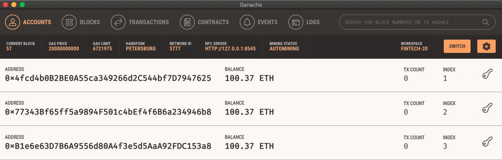
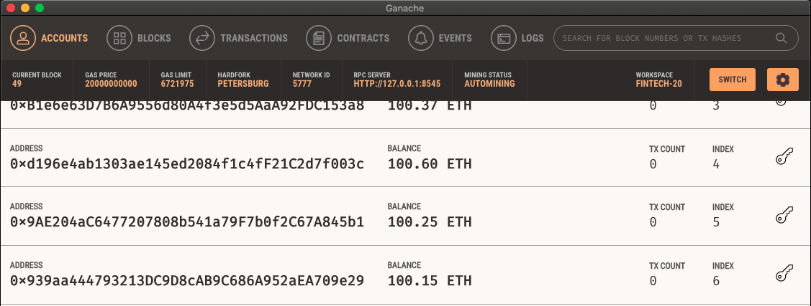
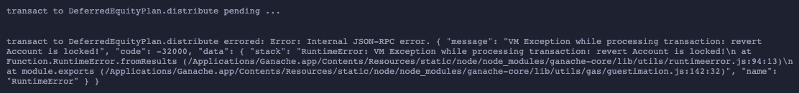
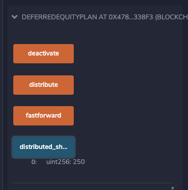

# our_first_smart_contracts
Create 3 smart contracts to pay employees, distribute profits to employees, and distribute company shares.

## Level 1: Splitting Profits

This contract (AssociateProfitSplitter.sol) will transfer 1/3 the amount submitted to the contract to 3 different addresses.  If the contract amount is "profit" a company earns, then this contract splits a profit amount in 3 equal parts to 3 different employees.  On a technical note, since uints are positive whole integers and Solidity does not support decimals, we must account for remainders.  As a result, the contract transfers the difference between the total contract amount and the amount transfered back to the sender (company). 

You can see the results of this contract in address indices 1-3. .8 ETH was transferred to the contract, and .27 ETH (rounded up) was added to their initial 100 ETH balances.

## Level 2: Splitting Profits By Tier

This contract (TieredProfitSplitter.sol) transfers amounts to 3 different employees like AssociateProfitSplitter.sol does, but not in equal amounts.  Instead, percentages are assigned to each employee and the amounts are transferred are based on those set percentages.  This contract allows for employees or receipeints to be grouped into specific tiers.

You can see the results of this contract in Ganache addresses 4-6.  1 ETH was transferred to the contract, and .6 ETH was transferred to address 4, .25 ETH to address 5, and .15 ETH to address 6.

* Deployed to Ropsten network at 0x68B94bb24Ee4530898EcdE58bCb3a350A385E0d1 address.

## Level 3: Deferred Equity Contributions

This contract (DeferredEquityPlan.sol) takes a given amount of shares of the company and distributes them to an employee at a specified time interval.  In this contract, an employee is awarded 1000 shares upon starting at the company, but receives them in 250 share installments paid out after 1 year of services.  So after working for 1 year, they receive 250 shares.  After 2 years, another 250 shares.  This process continues through 4 years--where the full 1000 shares have been distributed, or the employee leaves.  This contract utilizes a timelock so that based on the values of now and an 'unlock_time variable, distribution function will run.

Once the contract is deployed, if you try to distribute shares, there will be an error because 1 year (365 days) has not elapsed.

Hitting 'fastforward' will increase 'fakenow' by 100 days.  Once you fast forward 4 times, 'unlock_time' will be less than 'fakenow', the distribution will commence.  Check 'distributed_shares' to confirm.

* Deployed to Ropsten network at 0x55c0FFDaeb1949Ed0Ecd14763520322912115082 address.
